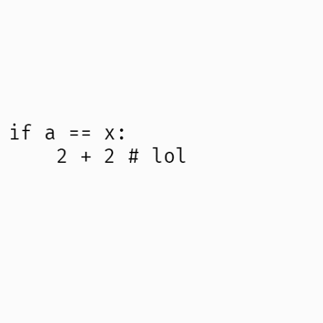

# Bicycle Repair Man
BRM is a python source rewriting library with the freedom you are looking for. It gives you a chance to intervene lexing before any tree-like structre constructed. You are free to do anything; change already constructed tokens with matching them according to your patterns, put **new** tokens and modify the lexer rules, refactor tons of python files without losing any information (full roundtripability).


This long paragraph can be boring, let me show you some examples of what you can actually.


I hate plus operator
```py
class DestoryAllOfThem(TokenTransformer):
    def visit_plus(self, token):
        return token._replace(string="-")

transformer = DestoryAllOfThem()
assert transformer.transform("(2p) + 2 # with my precious comment") == "(2p) - 2 # with my precious comment"
```

Why I have to use `x ** 0.5` in order to get square root of `x`, can't I just use a `√` operator?
```py
class SquareRoot(TokenTransformer):

    def register_squareroot(self):
        return "√"

    @pattern("squareroot", "number")
    def remove_varprefix(self, operator, token):
        return self.quick_tokenize(f"int({token.string} ** 0.5)")

sqr = SquareRoot()
assert eval(sqr.transform("√9 # some more comments")) == 3
assert "some more comments" in sqr.transform("√9 # some more comments")
```

## Making transformers permanent
If you like your transformer and use it on the real python files, you can use `~/.brm` folder. Actually you shouldn't depend that folder, you can just write your transformer and do this `cp transformer.py $(python -m brm)`. It should print out the right location for transformers. After that operation you can just add `# coding: brm` comment to every python file you want to use your transformers. If you already using an encoding you can keep using it with `# coding: brm-<encoding>` like `# coding: brm-utf8` etc. Let's do an example

```py
from brm import TokenTransformer, pattern

class AlwaysTrue(TokenTransformer):

    STRICT = False

    @pattern("name", "*any", "colon")
    def always_true_if(self, *tokens):
        statement, *_, colon = tokens
        if statement.string not in {"if", "elif", "while"}:
            return
        true, = self.quick_tokenize("True")
        return (statement, true, colon)

```
First of all, the `STRICT` state means do we care about how the result would look like. In this case, no. Because imagine this as a pre-processor, no one is going to see the result of processed text it except the interpreter it self. So we are free to swallow every location information (that won't break any code integrity).


This example's pattern starts with a  that catches a name, which could be a keyword but during the lexing you can't know if it is or not. Then it catches as many things as possible until it gets a colon. The transformer function assignes first token to `statement` and last token to `colon` and swallows all of the tokens between them. The swallowed tokens constructs the actual condition but they wont be needed because we'll just replace condition with True. After setting statement, we just acess `string` attribute (which contains the value of token) and check if it is a valid keyword. If it is not, we return `None` which means this transformer didn't change anything and continue. If it is a valid statement we'll use `quick_tokenize` method to get tokens from a string. It is returning a sequence so we'll do some unpacking with trailing comma. At the end we'll return a sequence of tokens; the statement it self (e.g `if` keyword), `True` token and the colon (`:`).


After we finish our work with transformer, we'll put this to the pre-processor folder of BRM. Transformers on that folder will be executed on every python interpreter run, and transform python sources if they use special brm coding (`# coding: brm`).

```
(.venv) [  9:12ÖS ]  [ isidentical@x200:~ ]
 $ cat -n r.py
     1  # coding: brm
     2
     3  a = 2
     4  if a > 2:
     5      print("LOL")
(.venv) [  9:12ÖS ]  [ isidentical@x200:~ ]
 $ cp test.py $(python -m brm)
(.venv) [  9:12ÖS ]  [ isidentical@x200:~ ]
 $ python r.py
LOL
```

TA-DA!

# BRM Pattern Syntax
BRM sees python source code as a stream of token types when it is searching a pattern. Imagine this code;
```py
if a == x:
    2 + 2 # lol
```
the text representation of this tokens is like this;
```
NAME NAME EQEQUAL NAME COLON NEWLINE INDENT NUMBER PLUS NUMBER COMMENT NEWLINE DEDENT ENDMARKER
```
And BRM process it like this





If you want to match binary plus operation here (`2 + 2`), you can create pattern with `number, plus, name`.
If you want to match if statement's body, you can use some implicit tokens (which we can't show in the gif :D) called `INDENT` and `DEDENT`. So If there are only simple expressions or statements inside to if's body, you can create a pattern that starts with an indent token and takes anything between that indent and the dedent token, `indent, *any, dedent`. Any is a pattern that expands to any token, like regex's `(.?*)` capturing group. 


Wanna try this? Just run `python visualize.py --help`
# Some minor functions
- `quick_tokenize(source: str)` => `List[TokenInfo]`, give some source and get some tokens that can construct the same source that was inputted.
- `quick_untokenize(tokens: Sequence[TokenInfo])` => `str`, give some sequence of tokens and get a string form of it without any usage of positions. It helps the cases when you dont want to deal with preceding issues about token locations. If you want to get a pretty input with using token locations, call `tokenize.untokenize` directly.
- `directional_length(tokens: Sequence[TokenInfo])` => `int`, calculate the X distance between start of the sequence and end of the sequence.
- `shift_all(tokens: Sequence[TokenInfo], x_offset: int, y_offset: int)` => `int`, shift positions of all tokens in the given sequence
- `_get_type(token: TokenInfo)` => `int`, returns the type of given token
- `until(toktype: int, stream: Union[Iterable, Iterator])` => `Generator[TokenInfo]`, gets and yields a token from stream until it gets a token with given type (it returns that token too!).

# Note
BRM can hijack your interactive sessions without notice, be aware!
